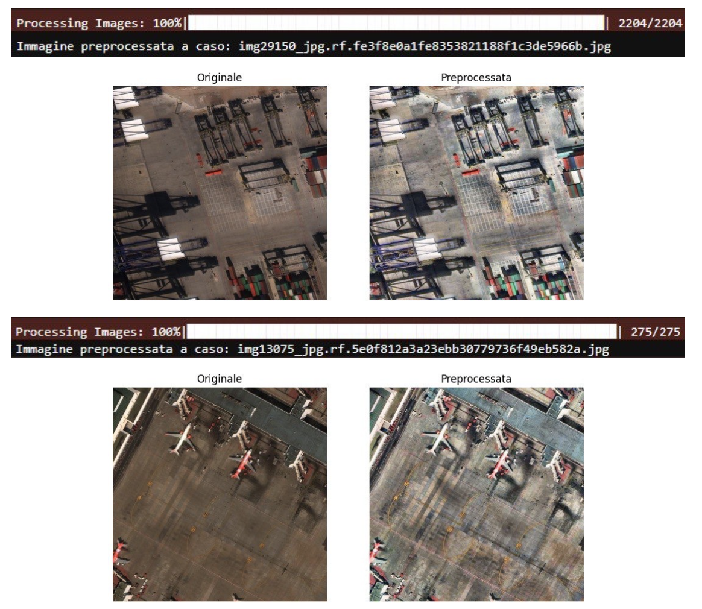
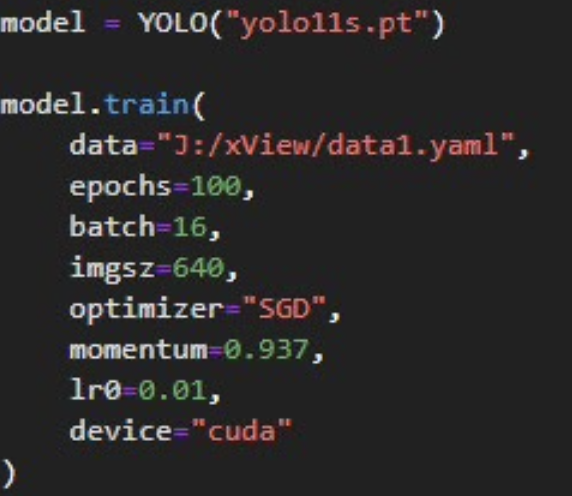
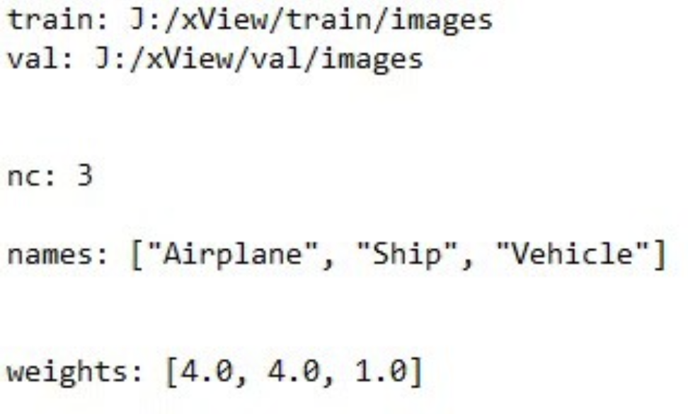
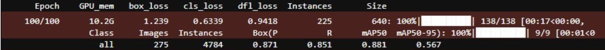
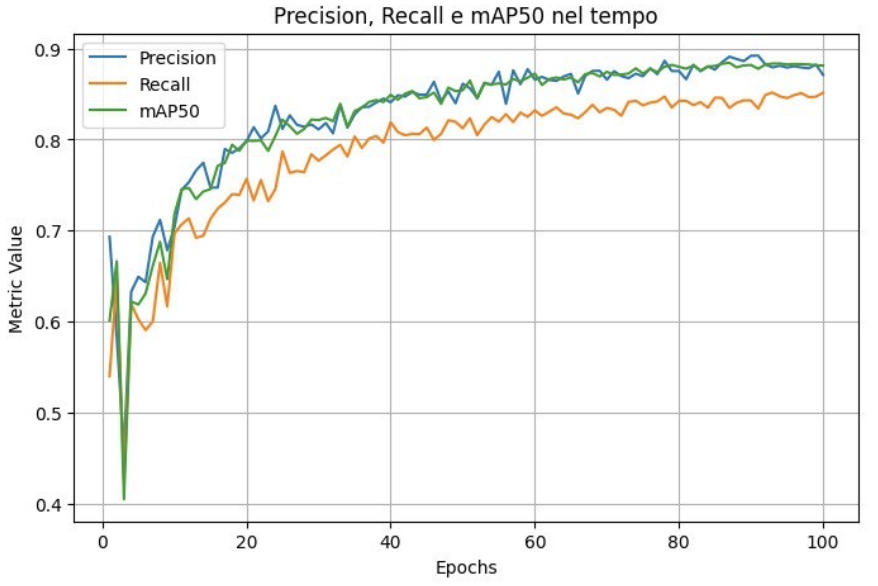
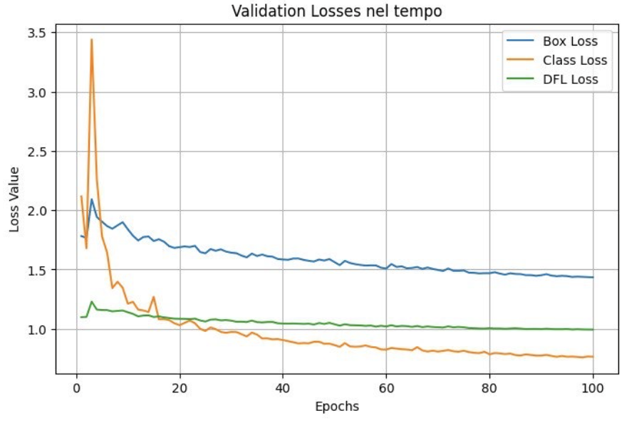
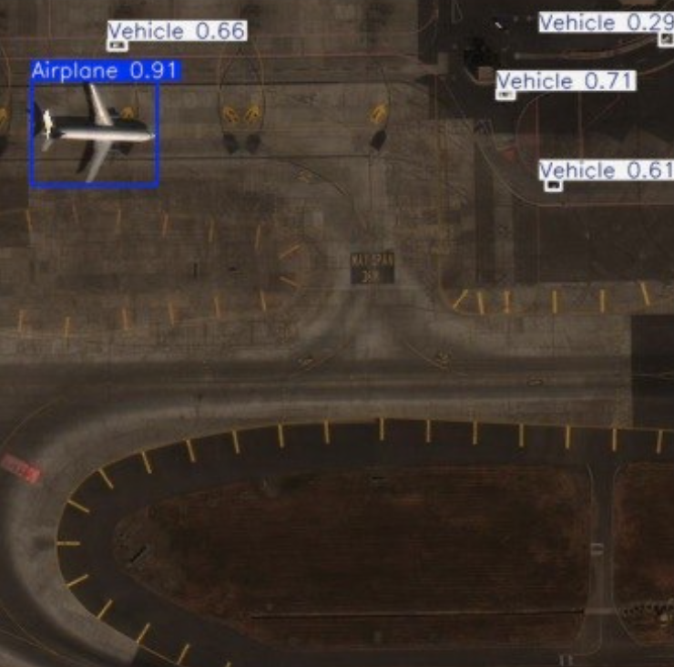

# Terrestrial Vehicle Detection and Classification in Satellite Images

This project was developed for the *Cognitive Computing Systems* course as part of my academic work as a master's degree student in Computer Engineering.

The work focuses on using a YOLOv11-based model to detect and classify terrestrial vehicles from high-resolution satellite images.

The code was developed and tested on Jupyter Lab.

# The dataset
The dataset consists of **1,920 satellite images**, extracted from the larger **xView** dataset.  
It contains three object classes:
- `Vehicle`
- `Ship`
- `Airplane`

# Step by step guide to run the project on any machine

  - Download the dataset from https://universe.roboflow.com/master-thesis-it8vi/xview-master-thesis/dataset/8, the version is "2023-04-27 7:38am"
  - Extract the content in the chosen directory (for example, J: on a windows machine)
  - In J:, create a folder for the project (for example, xView). Extract the content of the dataset in the created folder.
  - Delete the readme files.
  - Create two folders "images" and "labels", go to the folders train>images and val>images and move all the images to "images". Do the same for the labels.
  - Edit the data.yaml file in data1.yaml and add, at the end, "weights: [4.0, 4.0, 1.0]"
  - Start the project through Jupyter Lab.
  - For a matter of size, the folders train22 and predict have been omitted. They will be created by running the code (train22 from the training block and predict from the inference block).

## Important note about the code

The code in the file *satelliteImgClassifiction.ipynb* is almost entirely in English, with the only exception of the several *print(...)* which were left in Italian (my native language). This decision was made in order to preserve the cache of the outputs of each block.

## Project Overview

### Loading and analyzing the images
Firstly, all the class instances were counted, and by the result of the counting, a decision was made to oversample the classes 0 and 1.

The oversampling was done by duplicating the images (and respective labels) that only presented the classes 0 and/or 1.

The following image show the number of images that only present the classes 0 and 1, before the oversampling.

Then, an 80-10-10 split in training, validation and test set was done:

### Preprocessing

> *Note about the images*: The images in the dataset were already resized to have a resolution of **640x640**, a value desired by YOLO models, and they were already presenting geometric transformations such rotations and zooming.

Two techniques were applied, **only** to the images present in the training and validation sets:

  - **CLAHE**
  - **Gamma Correction**

The results of those are shown as follows:

### Implementing the model

As said before, the model chosen for this project was **YOLOv11**, the small version. The parameters in the image are the final ones, obtained through fine tuning and testing.

YOLO requires a **.yaml** file to run. The weights added to the 0 and 1 classes are to take into account the class imbalance.

After running for 100 epochs, the model achieved a **Precision of 0.871**, a **Recall of 0.851**, a value of **mAP50 of 0.881** and a value of **mAP50-95 of 0.567**.

 

The loss curves were deemed acceptable and it can be seen that, apart for an initial spike due to the model just starting to fit to the images, they follow the desired downward trend:

### Model inference

The inference of the model was performed against the images in the test set. At its completion, a folder **predict** got created, and inside are the images with bounding boxes and values of confidence.

## Key takeaways

The YOLOv11s based model performed well, thanks to the data augmentation applied and fine tuning of the hyperparameters.

Despite the good results, YOLO is flawed when it comes to detecting very small objects. 
This problem is due to how:
  - It divides the image in a grid, that could assign small objects to much bigger cells;
  - It performs a downsampling during the features extraction, that can lead to losing some critical details.

### Possible future developments

  - Usage of YOLOv11l or YOLOv11x that are much bigger models with better capabilities, although requiring much more ample computing power;
  - Application of the model to a bigger dataset to improve generalization;
  - Exploration more optimization and fine tuning techniques;
  - Usage of the model in real time application, such as scaling it to be used on edge devices mounted on UAVs.

