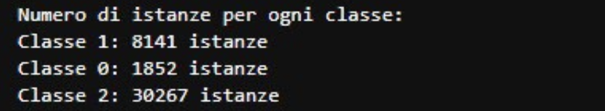
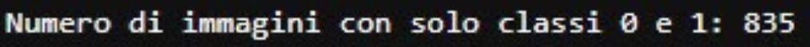
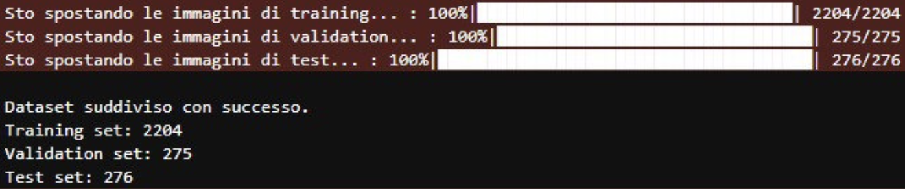

# Terrestrial Vehicle Detection and Classification in Satellite Images

This project was developed for the *Cognitive Computing Systems* course as part of my academic work as a master's degree student in Computer Engineering.

The work focuses on using a YOLOv11-based model to detect and classify terrestrial vehicles from high-resolution satellite images.

The code was developed and tested on Jupyter Lab.

# The dataset
The dataset consists of **1,920 satellite images**, extracted from the larger **xView** dataset.  
It contains three object classes:
- `Vehicle`
- `Ship`
- `Airplane`

# Step by step guide to run the project on any machine

  - Download the dataset from https://universe.roboflow.com/master-thesis-it8vi/xview-master-thesis/dataset/8, the version is "2023-04-27 7:38am"
  - Extract the content in the chosen directory (for example, J: on a windows machine)
  - In J:, create a folder for the project (for example, xView). Extract the content of the dataset in the created folder.
  - Delete the readme files.
  - Create two folders "images" and "labels", go to the folders train>images and val>images and move all the images to "images". Do the same for the labels.
  - Edit the data.yaml file in data1.yaml and add, at the end, "weights: [4.0, 4.0, 1.0]"
  - Start the project through Jupyter Lab.
  - For a matter of size, the folders train22 and predict have been omitted. They will be created by running the code (train22 from the training block and predict from the inference block).

# Project Overview

Firstly, all the class instances were counted, and by the result of the counting, a decision was made to oversample the classes 0 and 1.

The following image show the number of images that only present the classes 0 and 1.

Then, an 80-10-10 split in training, validation and test set was done:

